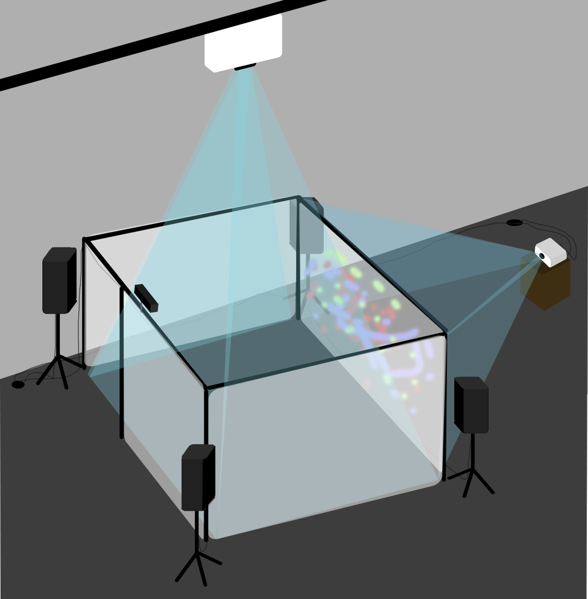
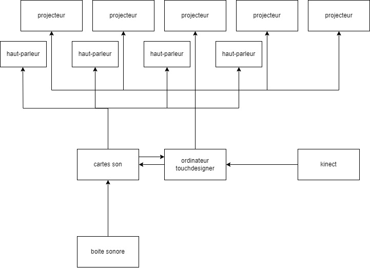

# Préproduction
> C'est ici qu'on dépose les éléments de la préproduction.

# Table des matières
1. [Intention ou concept](#Intention-ou-concept)
    - [Cartographie](#Cartographie)
    - [Intention de départ](#Intention-de-départ)
    - [Synopsis](#Synopsis)
    - [Moodboard](#Moodboard)
    - [Scénario, scénarimage ou document audio/visuel](#Scénario,-scénarimage-ou-document-audio/visuel)
2. [Contenu multimédia à intégrer](#Contenu-multimédia-à-intégrer)
    - [Inventaire du contenu multimédia](#Inventaire-du-contenu-multimédia)
    - [Univers artistique des éléments](#Univers-artistique-des-éléments-centraux)
3. [Planification technique d'un prototype (devis technique)](#Planification-technique-(devis-technique))
    - [Schémas ou plans techniques](#Schémas-ou-plans-techniques)
    - [Matériaux requis](#Matériaux-de-scénographie-requis)
    - [Équipements requis](#Équipements-requis)
    - [Logiciels requis](#Logiciels-requis)
    - [Ressources humaines requises](#Ressources-humaines-requises)
    - [Ressources spatiales requises (rangement et locaux)](#Ressources-spatiales-requises-(rangement-et-locaux))
    - [Contraintes techniques et potentiels problèmes de production](#Contraintes-techniques-et-potentiels-problèmes-de-production)
4. [Planification de la production d'un prototype (budget et étapes de réalisation)](#Planification-de-la-production-(budget-et-étapes-de-réalisation))
    - [Budget prévisionnel](#Budget-prévisionnel)
    - [Échéancier global](#Échéancier-global)
    - [Liste des tâches à réaliser](#Liste-des-tâches-à-réaliser)
    - [Rôles et responsabilités des membres de l'équipe](#Rôles-et-responsabilités-des-membres-de-l'équipe))
    - [Moments des rencontres d'équipe](#Moments-des-rencontres-d'équipe)

# Intention ou concept

## Intention de départ
Par ce projet, nous souhaitons pousser l'intéracteur à lâcher prise en créant soi-même un environnement immersif.

## Synopsis
Sonalux est une expérience divisée en 3 chapitres qui se distinguent par leur intensité graduelle. Chaque chapitre comportera différents éléments sonores et visuels accompagnés d'une introduction au tout début.  
Le public est appelé à découvrir les différents chapitres du projet.

## Moodboard
> 

> [Exemple d'art générative avec TouchDesigner](https://www.youtube.com/watch?v=lHsF-DKJZYc)

> [L'improvisation de l'eau avec TouchDesigner](https://www.youtube.com/watch?v=SbYtIiZdrew&t=1s)

> [Exemple d'art générative avec des particules dans TouchDesigner](https://www.youtube.com/watch?v=3snFQtLRJqs&t=2s)

> [Site de Maff](https://www.maff.tv/watch/infinity-room)

# Contenu multimédia à intégrer
## Inventaire du contenu multimédia

- 3 paysage visuel génératif (touchdesigner)
- 3 paysages sonores (vcv rack)
- 3 enregistrement de narration
- 6 modules multimédias (captation des données (kinect/boite son), interprétation des données, contrôle des tubes led, effets audiovisuels, contrôle vidéo/mapping projection, contrôle de la navigation utilisateur & des différents sous-modules).

# Planification technique d'un prototype (devis technique)
## Schémas ou plans techniques

### Plantation 

### Schéma de branchement 

## Matériel de scénographie requis

* 4 toiles pour rétroprojection
* Système d'accrochage au sol pour subdiviser l'endroit de déploiement/faux mur en toile

## Équipements requis

* Audio
    * 4 haut-parleurs actifs de 4"
    * 4 fils XLR 3 conducteurs de 15' (M->F)
    * Interface audio USB disposant 8 sorties et au moins 1 entrée

* Vidéo
    * 5 projecteurs vidéo lentille standard
    * Kinect v1

* Lumière
    * 8 tubes leds

* Électricité
    * 4 cordon IEC (pour l'alimentation des haut-parleurs)
    * 2 extentions 3 fiches et 3 conducteurs 
    * 2 multiprise

* Réseau
    * 4 fils cat6a de 15"
    * Switch poe 5 ports

* Ordinateur
    * 1 ordinateur portable 
    
* Autre
    * boite sonore (à créer)

## Logiciels requis

* [TouchDesigner](https://derivative.ca/UserGuide/TouchDesigner)
* [VCV Rack](https://vcvrack.com/)
* [Arduino IDE](https://www.arduino.cc/en/software)
* [Kinect v1.8 studio](https://www.microsoft.com/en-us/download/details.aspx?id=40278)

## Ressources humaines requises

* TTP, location de matériel
  
## Ressources spatiales requises (rangement et locaux)

* Grand studio
    * Rétroprojection vidéo dans le grand studio

## Contraintes techniques et potentiels problèmes de production

| Contrainte ou problème potentiel                                       | Solution envisagée                                                                                                                    
|------------------------------------------------------------------------|-------------------------------------------------------------------------------------------------------|
| Apprendre et maîtriser un tout nouveau logiciel, soit TouchDesigner.   | expérimentation durant la session |                                                                                              
| Apprendre a utiliser la kinect pour la captation live                  | expérimentation durant la session + documentation sur le web|                                                                    
|Réaliser la boîte sonore et intégrer les différentes composantes, 
c’est-à-dire analogues (sortie audio) et électriques (microcontrôleurs). | acheter le matériels nécéssaire |
|Relier la boîte au reste de l’installation.                             | faire plusieurs itération de visuel pour que le visuel et le son se complémente et intéragissent bien |

# Planification de la production d'un prototype (budget et étapes de réalisation)
## Budget prévisionnel

[Lien vers document](https://cmontmorency365.sharepoint.com/:x:/s/TIM-58266B-Expriencemultimdiainteractive-Enseignants/ERS3zx4iKAlLn03N_0h3cyQBOV_nxNuKvrKnqmrXGcgDYg?e=Rjq9Uc)

## Rôles et responsabilités des membres de l'équipe

**Vincent Desjardins**
- Coordination technique et artistique du projet
- Création du module d'interprétation des données (Kinect)
- Programmation du patch touchdesigner de génération vidéo.

**Camélie Laprise**

- Coordination technique du projet (coordination de l'échéancier, du budget, suivi de la liste des tâches à réaliser, s'assurer de la répartition du rôle et des responsabilités des membres de l'équipe)
- Création des paysages sonores
- Créations de visuels
- Installation de l'équipement dans l'espace physique.

**Ghita Alaoui**
- Création de visuels
- Mapping
- Installation de l'équipement dans l'espace physique.

**Antoine Haddad**
- Installation de l'équipement dans l'espace physique.
- Coordination des projections/projecteurs.
- Création du boîtier interactif au milieu de l'installation.

## Moments des rencontres d'équipe
Hebdomadaire
- lundi à 12h (1h-2h) : Rencontre de suivi de projet.

